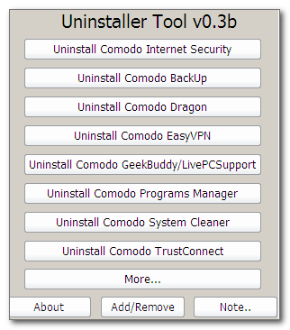
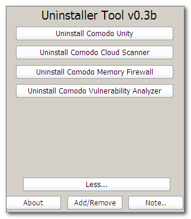

# Comodo-Uninstaller
[CMD/BATCH] The Scripts And Sources Used In Comodo-Forums For Purging Comodo-Related Products From One's PC

You can find it under your user-profile, in a "Uninstaller Tool(Comodo Forums)" folder.

